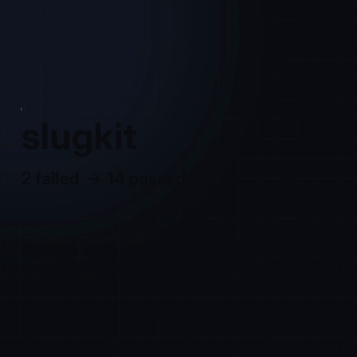

# sessionreel

**Your agent worked for two hours. Here is the 35-second version.**

`sessionreel` reads a Claude Code session log and renders a short recap video: the ask, the
test that went red, the diff that fixed it, the run that went green, what shipped. It runs
locally, redacts secrets before anything is drawn, and needs no API key.

<p align="center"></p>

```
uvx sessionreel            # newest session in this directory → reel.mp4
```

[한국어](README.ko.md)

## Why

Agent sessions are real work that nobody else can see. A teammate will not scrub a 30 MB
transcript, a client will not open a replay viewer, and a link on X is not a video. The tools
that exist are viewers (you go to them); sessionreel makes the thing you send.

What a reel is built from — all of it straight from the log:

| scene | source in the log |
|---|---|
| the ask | the prompt that started this piece of work |
| exploring | files read and searches run before the first change |
| red | a test/build command whose output shows failures (`pytest`, `jest`/`vitest`, `go test`, `cargo test`, `tsc`, `ruff`, `mypy`, `make <target>`) |
| the fix | the diffs Claude Code recorded between that red run and the next green run of the same check |
| green | the same check passing |
| shipped | a successful `git commit` / `git push` / `gh pr create` / publish, with the commit message |
| numbers | active time (breaks over 15 min don't count), tool calls, files and lines changed, tests |

No arc in the session? The reel is built from the largest edits instead. A long session with
many unrelated tasks? The reel tells one episode — from the ask that led to the fix up to the
next ask — so it doesn't end on another task's summary (`--whole` to override).

## Install

```
uvx sessionreel                                          # run without installing
pipx install sessionreel                                 # or install
uvx --from git+https://github.com/mandu5/sessionreel sessionreel   # latest main
```

Python 3.10+. ffmpeg is used if it's on your PATH, otherwise the bundled static build from
`imageio-ffmpeg`. Fonts are bundled (JetBrains Mono, Inter, Pretendard for Hangul, Noto Emoji).

**As a Claude Code plugin** — the agent that did the work writes the captions:

```
/plugin marketplace add mandu5/sessionreel
/plugin install sessionreel@sessionreel
/reel
```

`/reel` plans the storyboard, rewrites the captions from its own context (only claims the
scene data supports), and renders. Or `npx skills add mandu5/sessionreel`.

## Use

```
sessionreel                          # this session inside Claude Code; else the newest one for this directory
sessionreel 5e55a0d0                 # a session id prefix, or a path to a .jsonl
sessionreel list                     # recent sessions: id, time, prompts, tool calls, project
sessionreel demo                     # a bundled sample session — no logs needed

sessionreel --format wide            # 1920×1080   (square 1080×1080 is the default; tall 1080×1920)
sessionreel --lang ko                # Korean captions
sessionreel --voice                  # narrate with the OS voice (say / espeak-ng), no cloud TTS
sessionreel --gif                    # also write a GIF
sessionreel --redact 'ACME-\d+'      # extra pattern to scrub (repeatable)
sessionreel --project "client app"   # name shown on frames instead of the directory; --no-branch hides the branch
```

Edit before rendering:

```
sessionreel plan -o storyboard.json      # the story as JSON: scenes, captions, durations
$EDITOR storyboard.json                  # rewrite captions, drop a scene, change timing
sessionreel render storyboard.json -o reel.mp4
```

A 35-second 1080×1080 reel renders in about 30 seconds on an M1 Pro and is ~1 MB.

## Privacy

Redaction runs on the parsed session **before** the storyboard exists, so no later stage ever
sees the original strings, and it runs **again at render time** over every string in the
storyboard, so a caption edited by you or by an agent is checked too. It removes:

- provider keys and tokens (Anthropic, OpenAI, Stripe, GitHub, GitLab, npm, PyPI, AWS, Slack,
  SendGrid, Twilio, Google, Hugging Face), JWTs, bearer/basic auth, private-key blocks — also
  when they span lines inside a diff — webhook URLs, credentials and tokens in URLs;
- `SECRET=value`, `"api_key": "…"`, `--password …`, `mysql -p…`, `curl -u user:pass`;
- long high-entropy strings that look like credentials;
- your identity: home directory (→ `~`, including Claude Code's `-Users-you-…` form), username,
  hostname, `user@host` prompts, e-mail addresses;
- the contents of `.env*`, `*.pem`, `*.key`, `*.p12`, `*.tfvars`, `.git-credentials`,
  kube/docker/AWS credential files — never shown at all.

`plan` prints how many items were removed, by kind. `--project NAME` replaces the directory name
shown on every frame and `--no-branch` hides the git branch. Captions whose numbers do not appear
in the scene's data are flagged at render time.

Redaction is pattern-based. **Watch the video before you post it.** Nothing is uploaded
anywhere; sessionreel makes no network calls.

## FAQ

**Isn't this just a screen recording?** No recording happens. Every frame is drawn from the
log: the real command, the real output, the real diff hunks Claude Code stored. You can make a
reel of a session from last month.

**Does an LLM write the story?** No. The planner is deterministic and every caption is built
from numbers in the log. In plugin mode the agent may reword captions, but the skill forbids
claims the scene data doesn't support, and each scene keeps its original `fact`.

**Codex / Cursor / other agents?** Claude Code first. The ingest layer normalises to five event
kinds, so another log format is one adapter; Codex is next. PRs welcome.

**How is this different from claude-replay, mindwalk, zoetrope, claude-code-log?** Those are
viewers — interactive pages or TUIs you open and explore. sessionreel produces a 30–60 second
video that plays inline wherever you post it.

## How it works

`ingest` (JSONL → prompts, messages, tool calls joined to their results, diff hunks, token
usage) → `redact` → `story` (finds the red→fix→green arc, scopes the episode, packs scenes into
a time budget) → `render` (Pillow draws each frame; frames stream into ffmpeg as raw RGB →
H.264). Design notes: [DESIGN.md](DESIGN.md).

```
python -m pytest -q      # 140 tests: ingest, adversarial redaction, check parsing, arcs, storyboard safety, rendering, CLI
```

## License

MIT. Bundled fonts are under the SIL Open Font License 1.1 (see `src/sessionreel/fonts/`).
